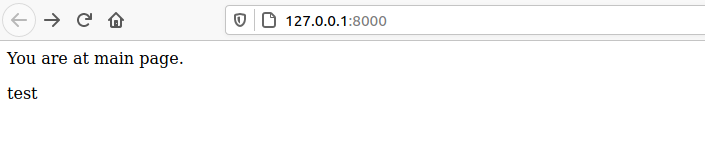
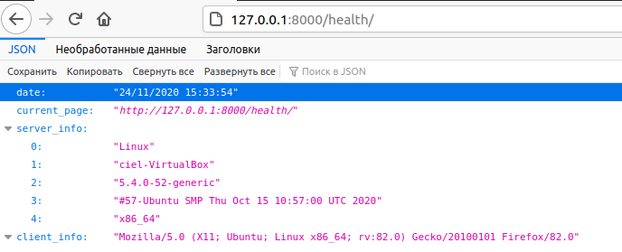

# LAB 3

## Хід роботи


1. За допомогою *Django Framework* створив заготовку проекту та виніс всі створені файли на один рівень вище
```
pipenv run django-admin startproject site_lab3
    
        mv site_lab3/site_lab3/* site_lab3/
        mv site_lab3/manage.py ./
```
2. Переконався, що все встановилось правильно `pipenv run python manage.py runserver`:
```
    November 24, 2020 - 14:29:54
    Django version 3.1.3, using settings 'test_site.settings'
    Starting development server at http://127.0.0.1:8000/
    Quit the server with CONTROL-C.
    [24/Nov/2020 14:30:02] "GET / HTTP/1.1" 200 167
    Not Found: /favicon.ico
```
3. Створив потрібні папки та файли.
4. Перевірив, як працюють сторінки `127.0.0.1:8000` та `127.0.0.1:8000/health`:<br/>


5. Створив файл monitoring.py та встановив бібліотеку:
```
pipenv install requests
```
6. Модифікував функцію `health`.
7. Дописав функціонал який виводить повідомлення про недоступність сайту у випадку якщо WEB сторінка недоступна.
8. Зробив так щоб програма `monitoring.py` запускалась раз в хвилину та працювала в бекграунді.
9. Cпростив роботу з пайтон середовищем через швидкий виклик довгих команд:
```
server = "python manage.py runserver"
monitoring = "python3 monitoring.py"
```
